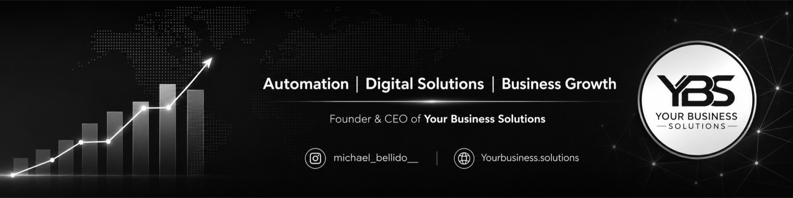

  

<h1 align="center">Michael Alexander Bellido König</h1>

  <strong>AI & Technology Consultant · Computer Engineering Student</strong>

  <picture>
    <source
      media="(prefers-color-scheme: dark)"
      srcset="https://readme-typing-svg.demolab.com?font=Inter&weight=600&size=22&pause=1200&color=FFFFFF&center=true&vCenter=true&width=1000&lines=Building+AI-powered+automation+and+CRM+systems;Turning+business+problems+into+measurable+results;Combining+technology%2C+strategy+and+client+delivery"
    />
    <source
      media="(prefers-color-scheme: light)"
      srcset="https://readme-typing-svg.demolab.com?font=Inter&weight=600&size=22&pause=1200&color=000000&center=true&vCenter=true&width=1000&lines=Building+AI-powered+automation+and+CRM+systems;Turning+business+problems+into+measurable+results;Combining+technology%2C+strategy+and+client+delivery"
    />
    
  </picture>

  
  
  
  

  
  
  

  <em>
    “I didn’t think I’d regret trying and failing. 
    I suspected I would always be haunted by a decision not to try at all.”
  </em>

<strong>— Jeff Bezos</strong>

## 01 · Professional Snapshot

I design and implement AI, automation, CRM, and digital systems that solve real business problems and produce measurable results.

I am a Computer Engineering student and AI & Technology Consultant based in Warsaw, Poland.

Through Your Business Solutions, I work directly with international clients to analyse inefficient processes, design practical solutions, and deliver technology that improves operations, customer acquisition, and business performance.

**Core Areas of Expertise**

AI automation & generative AI — practical AI-assisted workflows, agents, chatbots, and prompt engineering.

Custom CRM & lead management — systems for organising leads, managing customers, and automating follow-up.

Process optimisation & system integration — connecting websites, forms, APIs, databases, and business tools.

Technology consulting & client delivery — from discovery and technical audits to implementation and continuous improvement.

Data-driven digital growth — SEO, paid advertising, analytics, conversion optimisation, and local visibility.

Networking & security — VLANs, firewall policies, network segmentation, DNS, DHCP, and IoT isolation.

## 02 · Technology Stack

A structured overview of the languages, platforms, systems, and tools I use to design and deliver technical solutions.

### 01 — Programming Languages

  
  
  

### 02 — Web, Data & Integration

  
  
  
  
  
  
  

### 03 — Development & Systems

  
  
  
  
  
  
  
  

### 04 — AI & Automation

  
  
  
  
  
  
  
  
  
  
  

### 05 — CRM, Marketing & Analytics

  
  
  
  
  
  
  

### 06 — Networking & Security

  
  
  
  
  
  
  

## 03 · Business Impact

  <table>
    <tr>
      <td align="center" width="33%">
        <h3>6×</h3>
        Website traffic growth
      </td>
      <td align="center" width="33%">
        <h3>30+</h3>
        New 5-star reviews
      </td>
      <td align="center" width="33%">
        <h3>15 h/week</h3>
        Manual work eliminated
      </td>
    </tr>
    <tr>
      <td align="center">
        <h3>37 → 88</h3>
        Mobile PageSpeed
      </td>
      <td align="center">
        <h3>70+</h3>
        E-commerce accounts recovered
      </td>
      <td align="center">
        <h3>36%</h3>
        Increase in client sales
      </td>
    </tr>
  </table>

## 04 · What I Build

<table>
  <tr>
    <td valign="top" width="33%">
      <h3>AI & Automation</h3>
      <ul>
        <li>AI-assisted workflows</li>
        <li>AI chatbots and agents</li>
        <li>Prompt engineering</li>
        <li>Lead follow-up automation</li>
        <li>Repetitive-task elimination</li>
        <li>Data-driven processes</li>
      </ul>
    </td>
    <td valign="top" width="33%">
      <h3>Business Systems</h3>
      <ul>
        <li>Custom CRM systems</li>
        <li>Lead-source tracking</li>
        <li>Customer-management workflows</li>
        <li>Website and form integrations</li>
        <li>Reporting and analytics</li>
        <li>Process optimisation</li>
      </ul>
    </td>
    <td valign="top" width="33%">
      <h3>Digital Platforms</h3>
      <ul>
        <li>SEO-optimised websites</li>
        <li>Google Ads campaigns</li>
        <li>Conversion-focused landing pages</li>
        <li>Local search optimisation</li>
        <li>Customer-acquisition systems</li>
        <li>Performance monitoring</li>
      </ul>
    </td>
  </tr>
</table>

## 05 · Featured Projects

<table width="100%">
  <tr>
    <td valign="top">
      

        <h3>Property AI — RAG Chatbot for Real Estate</h3>
        
<strong>Real Estate · Portfolio Project</strong>

        

          
          
        

        

          
          
          
          
          
          
        

      

      

      

        Designed, built, and deployed an end-to-end Retrieval-Augmented Generation
        chatbot for a fictional Tenerife real-estate agency, combining a local
        vector store, multi-turn conversation memory, bilingual responses, and an
        automated LLM-as-judge evaluation suite.
      

      <h4>Key Results</h4>
      <ul>
        <li>Scored <strong>8/8 groundedness</strong> and <strong>5/5 adversarial safety</strong> on an automated LLM-as-judge evaluation suite.</li>
        <li>Found and patched a <strong>prompt-injection vulnerability</strong> surfaced by adversarial testing.</li>
        <li>Backed by <strong>34 automated tests</strong> covering retrieval, conversation memory, and error handling.</li>
        <li>Deployed live with Docker support and a CI pipeline running tests and linting on every push.</li>
      </ul>
      

        
<strong>View technical implementation</strong>

         
        <ul>
          <li>RAG pipeline: local Chroma vector store with sentence-transformers embeddings over property listings and FAQ data.</li>
          <li>Conversation memory with follow-up question condensation for natural multi-turn chat.</li>
          <li>Bilingual (EN/ES) responses with automatic language detection.</li>
          <li>Per-session question limit to protect the shared, free-tier LLM API quota.</li>
          <li>Friendly, logged error handling for LLM/API failures instead of raw tracebacks.</li>
          <li>Modular architecture (config, UI, prompts, retrieval, LLM client) with a full pytest suite.</li>
          <li>Dockerized and deployed on Streamlit Community Cloud.</li>
          <li>LLM-as-judge evaluation suite testing groundedness and adversarial/safety scenarios.</li>
        </ul>
      

    </td>
  </tr>
</table>

 

<table width="100%">
  <tr>
    <td valign="top">
      

        <h3>AI Automation, CRM & Growth Platform</h3>
        
<strong>Legal Services · Tenerife, Spain</strong>

        

          
          
          
          
          
        

      

      

      

        Designed and implemented a connected digital ecosystem combining a custom CRM,
        lead-source tracking, an SEO-optimised website, Google Ads, automated review
        generation, and customer-management workflows.
      

      <h4>Key Results</h4>
      <ul>
        <li>Increased monthly website traffic by <strong>6×</strong>.</li>
        <li>Generated <strong>30+ new 5-star reviews</strong> in one month.</li>
        <li>Improved mobile PageSpeed from <strong>37 to 88</strong>.</li>
        <li>Reduced manual administrative work by approximately <strong>15 hours per week</strong>.</li>
      </ul>
      

        
<strong>View project scope</strong>

         
        <ul>
          <li>Conducted a complete digital and technical audit.</li>
          <li>Identified website, SEO, UX, and conversion problems.</li>
          <li>Designed a custom CRM for clients and lead sources.</li>
          <li>Connected website forms with lead-management workflows.</li>
          <li>Implemented review-generation automation.</li>
          <li>Managed Google Ads and local SEO.</li>
          <li>Introduced analytics and continuous optimisation.</li>
        </ul>
      

    </td>
  </tr>
</table>

 

<table width="100%">
  <tr>
    <td valign="top">
      

        <h3>AI Chatbot, Advertising & Website Automation</h3>
        
<strong>Real Estate · Remote</strong>

        

          
          
          
          
          
        

      

      

      

        Developing an integrated customer-acquisition system designed to capture,
        qualify, organise, and follow up with potential clients across digital channels.
      

      <h4>Project Scope</h4>
      <ul>
        <li>AI-powered chatbot for initial customer interaction.</li>
        <li>Automated lead capture and enquiry routing.</li>
        <li>Google Ads campaign management.</li>
        <li>SEO-oriented website improvements.</li>
        <li>Google Maps and local visibility optimisation.</li>
        <li>Customer enquiry and follow-up workflows.</li>
      </ul>
    </td>
  </tr>
</table>

 

<table width="100%">
  <tr>
    <td valign="top">
      

        <h3>Secure Guest Wi-Fi & Network Segmentation</h3>
        
<strong>Restaurant IT Infrastructure</strong>

        

          
          
          
          
          
        

      

      

      

        Designed a secure four-zone network architecture that separates guest traffic,
        staff devices, business-critical systems, and IoT or CCTV equipment.
      

      <h4>Network Zones</h4>
      <ul>
        <li>Guest devices.</li>
        <li>Staff devices.</li>
        <li>Business-critical systems.</li>
        <li>IoT and CCTV equipment.</li>
      </ul>
      

        
<strong>View technical implementation</strong>

         
        <ul>
          <li>VLAN segmentation and structured IP addressing.</li>
          <li>Inter-VLAN firewall policies.</li>
          <li>Guest client isolation.</li>
          <li>IoT and CCTV isolation.</li>
          <li>DHCP ranges and reservations.</li>
          <li>DNS and content filtering.</li>
          <li>Captive portal access.</li>
          <li>Per-user bandwidth limits.</li>
          <li>Connectivity and isolation testing.</li>
          <li>Technical documentation and network diagram.</li>
        </ul>
      

    </td>
  </tr>
</table>

## 06 · Professional Experience

<table>
  <tr>
    <td valign="top" width="50%">
      <h3>Founder & Technology Consultant</h3>
      <strong>Your Business Solutions</strong> 
      Poland · Remote 
      2026 – Present
        
      <ul>
        <li>Deliver AI automation and CRM solutions</li>
        <li>Conduct client discovery and technical audits</li>
        <li>Design and implement digital workflows</li>
        <li>Manage Google Ads, SEO, and analytics</li>
        <li>Translate business needs into technology solutions</li>
        <li>Coordinate projects from strategy to delivery</li>
      </ul>
    </td>
    <td valign="top" width="50%">
      <h3>Digital Operations & E-Commerce Consultant</h3>
      <strong>Hydra Solutions</strong> 
      Germany · Remote 
      2023 – 2025
        
      <ul>
        <li>Supported international Amazon FBA clients</li>
        <li>Recovered more than 70 suspended accounts</li>
        <li>Optimised over 300 product listings</li>
        <li>Managed PPC and marketplace operations</li>
        <li>Coordinated international client communication</li>
        <li>Contributed to a 36% increase in client sales</li>
      </ul>
    </td>
  </tr>
</table>

## 07 · Education

<table>
  <tr>
    <td valign="top" width="50%">
      <h3>Bachelor's Degree in Computer Engineering</h3>
      <strong>Polish-Japanese Academy of Information Technology</strong> 
      Warsaw, Poland 
      2025 – Present
    </td>
    <td valign="top" width="50%">
      <h3>Computer Engineering Studies</h3>
      <strong>Universidad de Las Palmas de Gran Canaria</strong> 
      Spain 
      2022 – 2025
    </td>
  </tr>
</table>

## 08 · Certifications

- Data Science with Artificial Intelligence — BIG School
- AI Engineering: From Fundamentals to AI Agents — BIG School
- AI Development with Agents — BIG School
- AI-Powered Digital Marketing — BIG School
- SEO for AI & Google — BIG School

## 09 · Languages

  
  
  
  
  

## 10 · Current Focus

Building — AI automation, CRM systems, and business workflows.

Learning — production-oriented AI, APIs, and system integration.

Developing — practical projects with measurable business impact.

Exploring — AI agents, data, and technology consulting.

Seeking — IT and software roles in Poland, from automation and AI-driven systems to broader engineering and technical positions.
